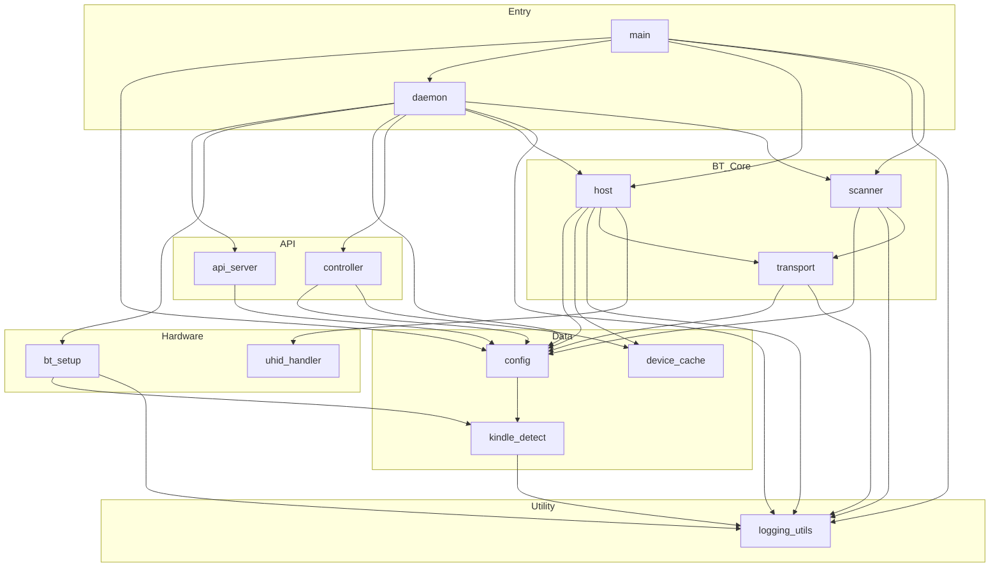

# Dependency Graph — kindle_hid_passthrough

## Module Layers

```
Entry       →  daemon.py, main.py
API         →  api_server.py, controller.py
BT Core     →  host.py, scanner.py, transport.py
Hardware    →  bt_setup.py, uhid_handler.py
Data        →  config.py, device_cache.py, kindle_detect.py
Utility     →  logging_utils.py
```

## Inter-Module Dependencies



## Redundancy Analysis

### Resolved (this session)

| Issue | Resolution |
|-------|-----------|
| api_server built device JSON directly from config | Routed through controller.get_status() |
| controller created HIDHost/Scanner instances | Moved to daemon.pair() and daemon.scan() |
| daemon reached into host internals for connection state | Added HIDHost.connection_state property |
| daemon used throwaway HIDHost for auth key cleanup | Uses config.remove_pairing_key() directly |
| controller had redundant method pairs (connect/resume, stop/disconnect) | Merged into request_connect() and request_disconnect() |
| host.py had duplicated report forwarding in classic and BLE paths | Extracted _forward_report() |
| host.py had duplicated descriptor loading in classic and BLE paths | Extracted _load_cached_descriptor() |
| host.py had duplicated BLE HID setup in pair and reconnect paths | Extracted _setup_ble_hid() |
| host.py had duplicated classic HID finalization in pair and reconnect paths | Extracted _finalize_classic_hid() |
| host.py had dead clear_stale_key method (no callers) | Deleted |
| host.py had debug monkey-patch in start() | Deleted |

| Transport init duplicated in scanner.py and host.py | Extracted `create_bumble_device()` in transport.py |

### Remaining

No known cross-module redundancy.
