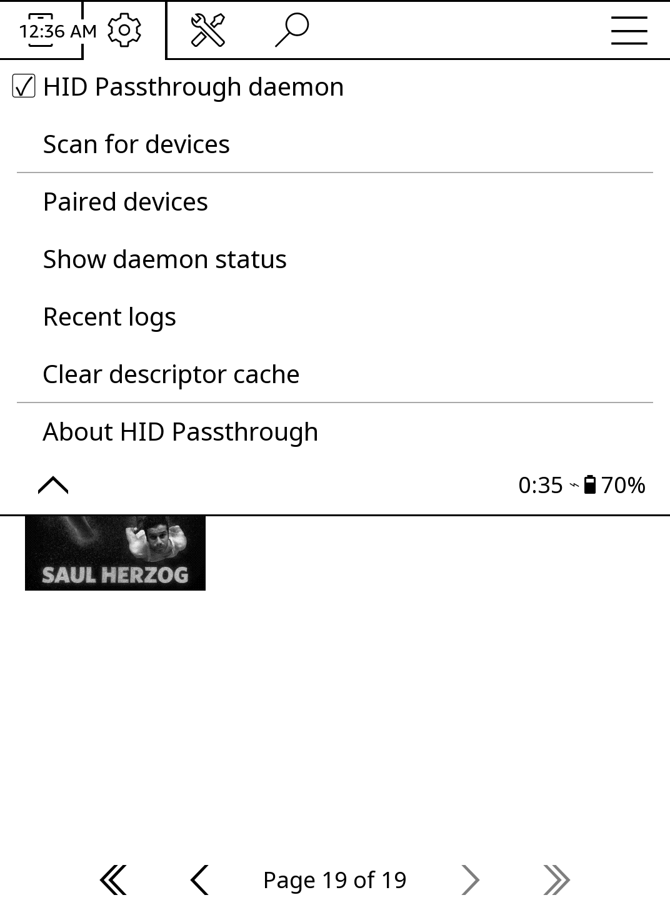

# KOReader Plugin: HID Passthrough

KOReader plugin that lets users start/stop the kindle-hid-passthrough Bluetooth HID daemon from within KOReader.

Originally created by [@alllexx88](https://github.com/alllexx88) (see [issue #40](https://github.com/zampierilucas/kindle-hid-passthrough/issues/40)).



## Features

Full feature parity with the BTManager WAF app — you can manage everything from inside KOReader, no need to exit.

- Adds a "HID Passthrough" entry under Settings > Network
- **Daemon control**: start / stop / toggle the HID daemon (also bindable to gestures via Dispatcher actions)
- **Scan for devices**: discovers nearby BLE and Classic HID devices, with live-updating results menu
- **Paired devices**: list paired devices with connect / disconnect / remove (forget) actions
- **Recent logs**: in-app log viewer with refresh, useful for debugging pairing issues
- **Clear descriptor cache**: drop cached HID descriptors
- **Daemon status**: version, configured devices, connected device, scanning / pairing flags

## Requirements

KOReader 2026.07 "Sailing Walrus" or newer. Keyboards that connect while KOReader is running are picked up by KOReader's own `externalkeyboard` plugin, via the uevent input hot-plug support added in [koreader/koreader-base#2327](https://github.com/koreader/koreader-base/pull/2327) and [koreader/koreader#15248](https://github.com/koreader/koreader/pull/15248).

On older builds this plugin's daemon controls still work, but a keyboard connected after KOReader started won't be seen until you restart KOReader.

## Installation

Copy the `hidpassthrough.koplugin` directory to your KOReader plugins folder:

```
cp -r hidpassthrough.koplugin /mnt/us/koreader/plugins/
```

Then restart KOReader.

The kindle-hid-passthrough daemon must already be installed on the device at `/mnt/us/kindle_hid_passthrough/kindle-hid-passthrough`. See the main project README for installation instructions.

## Opening the menu

In KOReader, tap the top of the screen to bring up the menu bar, then:

**cog icon (Settings) → Network → HID Passthrough**

The sub-menu shows the daemon toggle, scan, paired devices, logs, and cache controls (see screenshot above). Long-pressing the "HID Passthrough" parent entry toggles the daemon without descending into the sub-menu.
